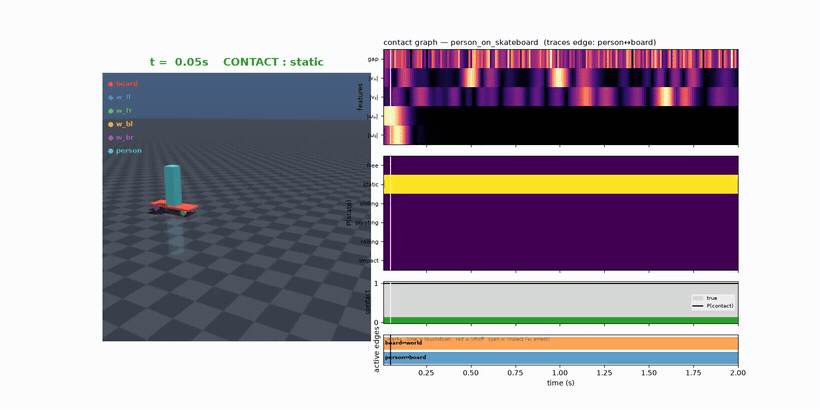
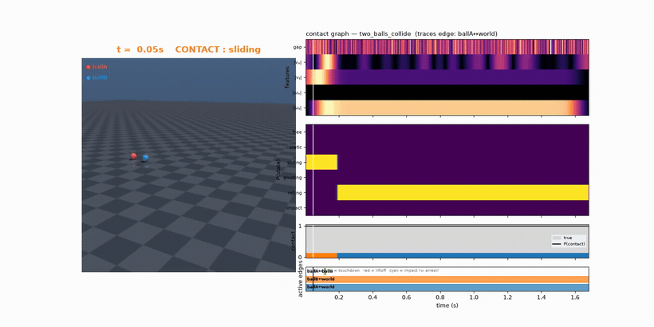
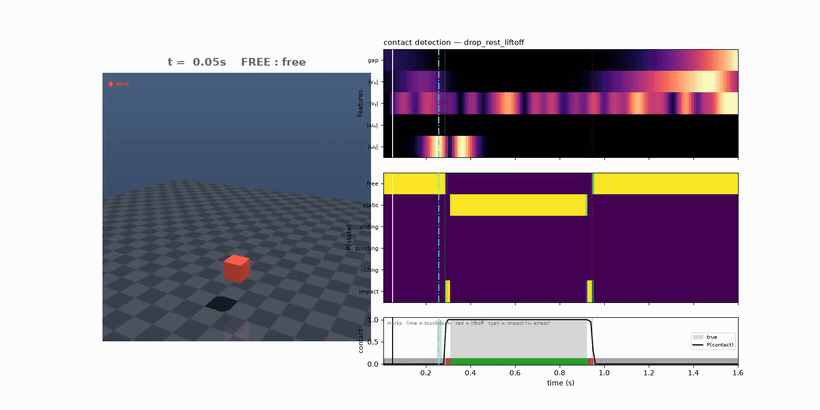

# Contact detection from first principles

A probabilistic, support-relative **contact-state estimator** for motion data, and
the full derivation of why it is built the way it is. Given the trajectories of two
bodies it answers — per frame, with calibrated uncertainty — *are they in contact,
and what kind of contact* (static, sliding, pivoting, rolling, impact), plus the
make/break event times and, when material stiffness is known, the contact force.

## See it in action

Each demo is the detector run end-to-end, rendered as a synced video: the MuJoCo-simulated
scene on the left, the live signals + detection on the right — feature heatmaps, the full
per-mode **state posterior**, **P(contact)**, and the active **contact-graph edges** — all
locked to one playhead.

**A foot riding a moving skateboard reads as _static_ contact despite ~1 m/s of world motion — the relative-frame payoff:**



**Two balls collide — a single clean impact between them (the sphere–sphere geometry turns 7 phantom impacts into 1), each rolling on the floor before and after:**



**The canonical story — free-fall → impact → resting static contact → liftoff, every channel synced to one playhead:**



> Generated with `uv run python viz.py <demo> --pairs` (add `--force` to feed the force channel
> so force-mediated contacts like a Newton's-cradle clack light up). The full `media/` gallery is
> fully regeneratable and git-ignored; these GIFs in [`assets/`](assets/) are the lightweight preview.

Three things live here:

- **[THEORY.md](THEORY.md)** — the theory built from the ground up. It starts from the
  naive "close and not moving" detector and, by repeatedly finding the exact case that
  breaks the current idea, derives the full object: a probabilistic hybrid dynamical
  system inferred as a Bayesian posterior over active-constraint structures. Read this
  first; the code cites its section numbers throughout.
- **[DESIGN.md](DESIGN.md)** — the engineering path that *generalizes* the estimator beyond
  the validated "known point on a flat, non-rotating floor" regime into a **capability-driven**
  estimator: one inference fed by whatever the user can provide (shape, force, material…),
  each capability an optional, gated factor that sharpens the posterior and degrades
  gracefully when absent. It records the build (Phases 0–5) and the per-fix evidence.
- **The [`contact/`](contact/) package** — the implementation of both, validated against
  physics ground truth from MuJoCo.

The original single-file toy ([main.py](main.py)) is kept as "rung 0" — the rudimentary
chi-squared detector the theory critiques and supersedes.

## The model in one breath

Each frame is explained by a latent contact state. **Free** is a diffuse "could be
anywhere, moving any way"; each **contact mode** is a sharp peak on a subspace of the
relative *twist* (the 6-vector of relative linear + angular velocity at the contact) —
which is what lets rolling (tangential velocity coupled to spin) be distinguished from
sliding-plus-spinning. The per-frame evidence is a calibrated **likelihood ratio**
between these, and an **HMM** (forward–backward for the posterior, Viterbi for the
segmentation) supplies the temporal prior — replacing all ad-hoc smoothing/cleanup with
one principled mechanism. The resting-gap offset is self-calibrated by **EM**. All of
this is measured *support-relative*, so a foot on a moving skateboard reads as static
contact despite huge world-frame velocity.

See THEORY.md for the rationale behind every clause above.

## Package layout

| module | role | THEORY.md |
|---|---|---|
| [`contact/types.py`](contact/types.py) | shared data contracts | — |
| [`contact/config.py`](contact/config.py) | physical / statistical parameters | — |
| [`contact/signals.py`](contact/signals.py) | time-aware smoothing & robust differentiation | §6 |
| [`contact/geometry.py`](contact/geometry.py) | body-pair → support-relative gap + twist (the resolver narrow waist) | §1, §3 |
| [`contact/geometry_resolvers.py`](contact/geometry_resolvers.py) | contact-geometry fidelity ladder: `FlatRegion` / `SpherePlane` / `SphereSphere` / `BoxPlane` / `MeshPlane` / `MeshConvex` | DESIGN |
| [`contact/mesh_collision.py`](contact/mesh_collision.py) | convex collision (signed distance + penetration) via [`coal`](https://github.com/coal-library/coal) | DESIGN §3 |
| [`contact/emissions.py`](contact/emissions.py) | the contact modes as generative models: `ContactMode` → `Free`/`Static`/`Sliding`/`Pivoting`/`Rolling`/`Impact` (rolling coupling; optional force factor) | §3, §4 |
| [`contact/hmm.py`](contact/hmm.py) | the `HMM` engine (a `TemporalSmoother`): log-space forward–backward + Viterbi | §5 |
| [`contact/transitions.py`](contact/transitions.py) | gap-gated, state-dependent transition tensors | §5 |
| [`contact/hsmm.py`](contact/hsmm.py) | the `SemiMarkovHMM` engine: explicit-duration (semi-Markov) decoding | §5 |
| [`contact/events.py`](contact/events.py) | sub-frame touchdown / liftoff detection | §6 |
| [`contact/impacts.py`](contact/impacts.py) | matched-filter impacts, restitution, force-as-measure | §6 |
| [`contact/dynamics.py`](contact/dynamics.py) | friction cone, force-from-penetration, observability demo | §7 |
| [`contact/model.py`](contact/model.py) | `ContactDetector`: EM calibration + `HMM`/`SemiMarkovHMM` assembly | §5, §7 |
| [`contact/graph.py`](contact/graph.py) | multi-body contact graph + active-set inference | §8 |
| [`contact/consistency.py`](contact/consistency.py) | soft energy/dissipation + balance priors | §8 |
| [`contact/structure_inference.py`](contact/structure_inference.py) | `StructurePosterior`: exact + particle-filter active-set posterior (the multi-body analog of `HMM`) | §8 |
| [`contact/mode_discovery.py`](contact/mode_discovery.py) | sticky HDP-HMM unsupervised mode discovery | §8 |
| [`contact/uncertainty.py`](contact/uncertainty.py) | per-frame measurement-uncertainty tempering | §8 |
| [`contact/dynamics_id.py`](contact/dynamics_id.py) | contact-implicit inverse dynamics + `infer_normal_force` (the force virtual sensor) | §8, DESIGN |
| [`contact/capabilities.py`](contact/capabilities.py) | capability registry (`detect_pair`) + value-of-information | DESIGN |
| [`contact/mujoco_gen.py`](contact/mujoco_gen.py) | MuJoCo ground-truth scenario / scene factory | §9 |
| [`contact/report.py`](contact/report.py) | scoring, terminal report, plotting | — |

## Run it

```bash
uv run python detect.py --scenario rolling_ball          # generate → detect → score → plot
uv run python detect.py --scenario moving_support --no-plot
uv run python detect.py --scenario drop_rest_liftoff --stiffness 50000
```

**Single-pair scenarios** (all physically simulated, fully labeled), grouped by what
they exercise:

- *core* — `drop_rest`, `drop_rest_liftoff`, `push_to_slide`, `rolling_ball`,
  `bouncing_ball`, `moving_support`, `indeterminate_rig`.
- *motion modes* — `incline_slide`, `skid_to_rest`, `spinning_top`, `tumbling_box`
  (sliding on a tilted plane, friction-arrest, pivoting, and a tumbling box).
- *impacts* — `hard_drop`, `restitution_bounce`, `angled_impact`, `drop_on_incline`
  (a single decisive touchdown, a decaying bounce train, an oblique bounce, and an
  impact against a tilted normal).

**Multi-body scenes** (the contact-graph active-set inference of §8; run them through
`generate_scene` + `detect_scene`, or watch them with `viz.py` below), grouped by
structure:

- *graph / active-set* — `person_on_skateboard`, `box_on_two_blocks`.
- *stacks & hand-offs* — `stacked_boxes`, `stack_topple`, `box_off_table`.
- *chained impacts* — `two_balls_collide`, `dominoes`, `newtons_cradle`.

The detector sees only noisy marker poses; MuJoCo's true contacts, forces, penetration,
and modes are withheld and used only to score.

Programmatic use:

```python
from contact import generate, observe, ContactDetector

raw = generate("push_to_slide")
obs = observe(raw.moving, raw.support, raw.surface, raw.contact_point_local)
result = ContactDetector().detect(obs)
# result.contact_posterior, result.map_state, result.intervals, result.events, ...
```

## Watch it

Two kinds of synced video; outputs are organized under `media/`:

### Per-pair contact videos — `media/pairs/` (the clearest view)

```bash
uv run python viz.py person_on_skateboard --pairs   # one video per contact pair
```

Each video follows **one fixed body pair** (one contact relationship). Those two bodies
are coloured — **moving = teal, support = orange** — and **every other body is faded to
dark the whole time**, so it is unmistakable which bodies the contact is between. The
camera is steady (no confusing cuts): it gently tracks the pair and, at each of that
pair's contact events, **smoothly zooms and reorients to look across the contact normal**
(so the gap opening/closing is broadside) in **slow-motion** (~13×), cruising at real time
between. The right column is the synced **heatmap timeline** (every feature channel, the
full per-mode state posterior, and P(contact) + mode ribbon + impact markers). A scene
with N contact pairs writes N videos, e.g. `media/pairs/person_on_skateboard__person__board.mp4`.

Add `--force` to feed the force channel (a stand-in sensor) so force-mediated contacts the
kinematics can't see light up as IMPACT — e.g. `uv run python viz.py newtons_cradle --pairs --force`
makes the cradle clacks appear (written `…__force.mp4` beside the kinematic versions).

### Overviews — `media/overviews/` (whole-demo summary)

```bash
uv run python viz.py drop_rest_liftoff              # media/overviews/drop_rest_liftoff.mp4
uv run python viz.py push_to_slide --stiffness 80000
```

The full clip in one synced view: rendered scene (body-colour legend, `A↔B` active-set
lanes for scenes) on the left, the heatmap timeline on the right, one playhead.

### Per-event clips — `media/events/` (optional)

```bash
uv run python viz.py bouncing_ball --events         # one zoomed slow-mo clip per event
```

## Validation

```bash
uv run pytest                       # unit + integration + expectation asserts
uv run python verify_demos.py       # the expectation report (PASS / WARN / FAIL per demo)
```

Unit tests cover the math (HMM recursions, emission densities, the relative-frame
geometry, differentiation). **Expectation checks** ([`contact/verification.py`](contact/verification.py))
encode each demo's physically-expected contact/mode story — e.g. `push_to_slide` must go
static→sliding, `box_off_table` must hand off `{table}→{}→{floor}`, `moving_support` must
read *static* despite 1.4 m of world motion, the cradle must be *suspended* with the
end-ball-out signature — and assert the detection matches it (not merely a passing IoU).
`verify_demos.py` prints the same checks as a report. Representative contact IoU / mode
accuracy: `moving_support` 0.99 / 1.00, `rolling_ball` 1.00 / 1.00, `incline_slide` 1.00,
`two_balls_collide` edges 0.97 / 0.95 / 0.80.

## What is implemented

All of THEORY.md §1–§9:

- **§1, §3** support-relative gap + twist; moving-on-moving contact (person on a moving board).
- **§3, §4** the mode taxonomy (static/sliding/pivoting/rolling/impact) as twist subspaces, with a calibrated likelihood ratio.
- **§5** the HMM with **gap-gated, state-dependent transitions** and **explicit-duration (semi-Markov) decoding**.
- **§6** **matched-filter impacts**, restitution estimation, and the force-as-measure (impulse atoms).
- **§7** the dynamics layer: friction-cone **stick/slip**, **force-from-penetration** under known compliance, and the **observability theorem demo** (load split unrecoverable from rigid statics, recovered via `k·penetration`).
- **§8** the multi-body **contact graph** with **active-set structure inference** (exact 2^E enumeration + a Rao–Blackwellized **particle filter** for large graphs), soft **energy/balance** priors, unsupervised **HDP-HMM mode discovery**, per-frame **measurement-uncertainty** tempering, and the **north star**: **contact-implicit inverse dynamics** — recovering the active set and contact forces that explain the observed motion under Newton–Euler dynamics with Signorini complementarity and the Coulomb friction cone (validated against MuJoCo: recovered `Σf_n` within ~0.3% of `m·g`). The frontier additions (particle filter, mode discovery, uncertainty, inverse dynamics) are **off by default** and non-regressing.
- **§9** the MuJoCo ground-truth oracle for every scenario above.

The dynamic and kinematic inferences are complementary: the kinematic detector reads contact off
motion and geometry; the inverse-dynamics layer reads it off *force necessity*. The energy/balance
graph priors remain the soft, best-effort version of a global physics consistency check.
`bouncing_ball` is the weakest scenario (sub-frame bounces the persistence prior bridges) — see the
integration test's comment.

## Generalizing it: the capability-driven estimator ([DESIGN.md](DESIGN.md))

The implementation above is exact for the canonical case — a *known point on a body, on a flat,
non-rotating floor*. DESIGN.md generalizes it **without disturbing that validated floor**, on the
principle that *observability is a function of the priors you have*: **one** Bayesian inference, fed
by whatever the user can provide, each capability an **optional, gated factor** that sharpens the
posterior and is a **no-op when absent** (an empty declaration reproduces the kinematic/flat-floor
detector byte-for-byte — regression-locked across every build).

**Axis 1 — geometry fidelity.** A per-frame `ContactGeometry` resolver, chosen for the declared
shape, behind one narrow waist (`observe(..., geometry=…)`):

| resolver | for | what it fixes |
|---|---|---|
| `FlatRegion` *(default)* | unknown shape / flat floor | the validated, bit-identical baseline |
| `SpherePlane` / `SphereSphere` | spheres | ball-ball "7 phantom impacts" → 1 (position-derived normal); cradle closing velocity |
| `BoxPlane` | box on a plane | tumbling: nearest-corner gap (225 mm→0) + analytic migrating-contact velocity |
| `MeshPlane` / `MeshConvex` | arbitrary convex meshes | exact mesh-vs-plane; GJK distance + EPA penetration mesh-vs-mesh |

**Axis 2 — force.** An optional `normal_force` observation channel + a per-state force emission
(free half-normal / contact mixture / impact spike), fed either by a **measured** sensor or an
**inferred** virtual sensor ([`dynamics_id.infer_normal_force`](contact/dynamics_id.py), recovered
from kinematics + inertials with *no* sensor — corr ≈0.94 vs truth). This is the only thing that
recovers **force-mediated contacts kinematics cannot see** — the Newton's-cradle clacks (~0
relative velocity, sharp force pulse). Try it: `uv run python viz.py newtons_cradle --pairs --force`.

**The registry + value-of-information** ([`contact/capabilities.py`](contact/capabilities.py)) tie
it together — declare what you have, get the richest estimator; ask what to provide next:

```python
from contact.capabilities import Capabilities, detect_pair, value_of_information

# Declare available capabilities; the richest resolver + factors are selected automatically.
caps = Capabilities(shape="sphere_sphere", params={"r_moving": 0.05, "r_support": 0.05})
result = detect_pair(moving, support, surface, contact_point_local, caps)

# Ask what to provide next: ranks candidate capabilities by how much they'd change the answer.
voi = value_of_information(
    moving, support, surface, contact_point_local,
    base=caps, candidates={"force": Capabilities(force="measured")}, truth_force=sensor,
)
# -> [("force", 0.13), ...] sorted by informativeness, plus voi.guidance:
#    "unobservable from kinematics → declare a force channel"
```

See DESIGN.md for the build status (Phases 0–5, all ✅) and the per-fix evidence. (The
coplanar box-vs-box penetration case that was once the open frontier is now handled by the
[`coal`](https://github.com/coal-library/coal) collision backend — exact to the prior kernel.)
